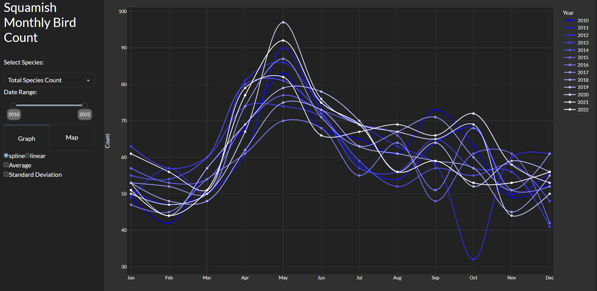
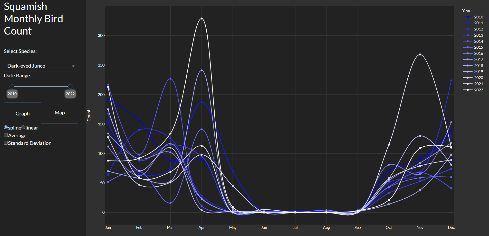
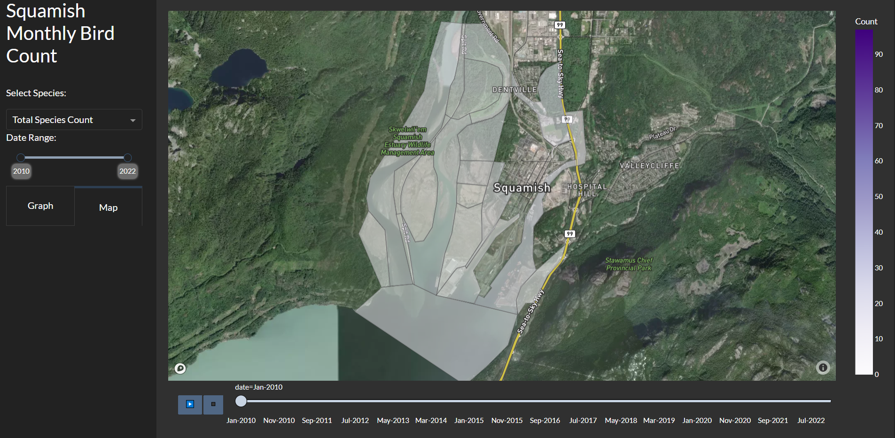

# Squamish Monthly Bird Count Dashboard

The goal of this project is to provide a dashboard to visualize bird count data from the Squamish Monthly Bird Count. The project uses Plotly Dash and is currently running on a Google Cloud Platform Compute Engine instance.

Check out the demo [here](http://35.230.111.2:8050/)

